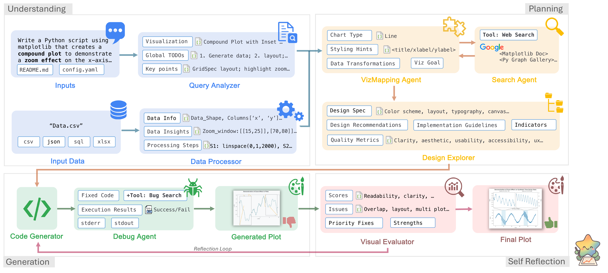
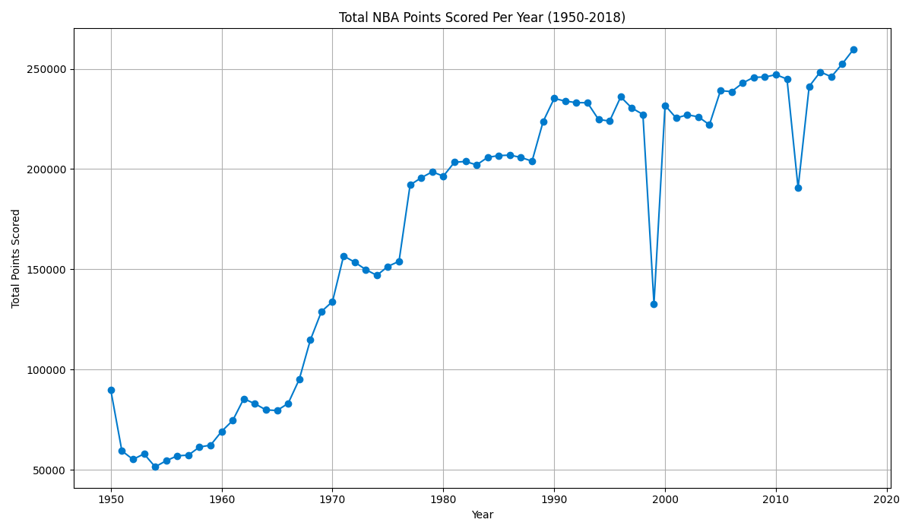
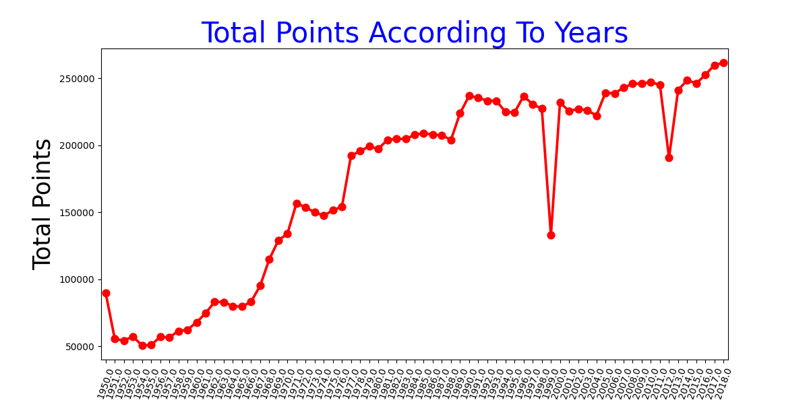
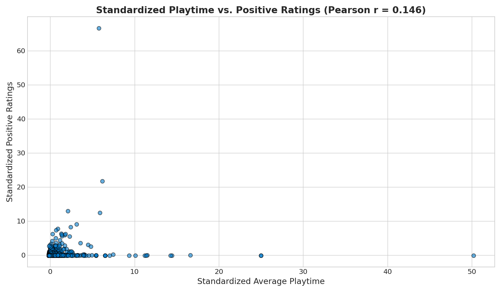
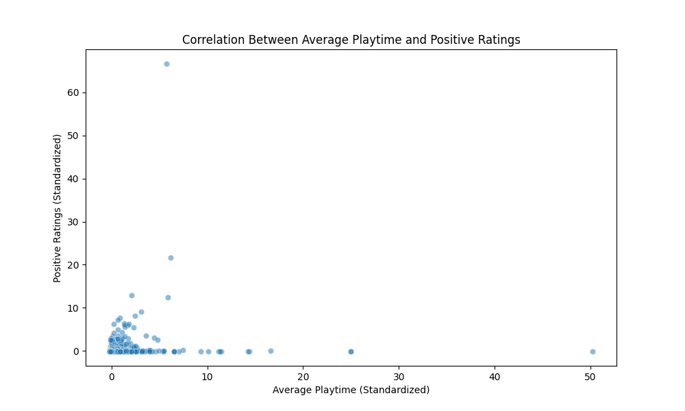
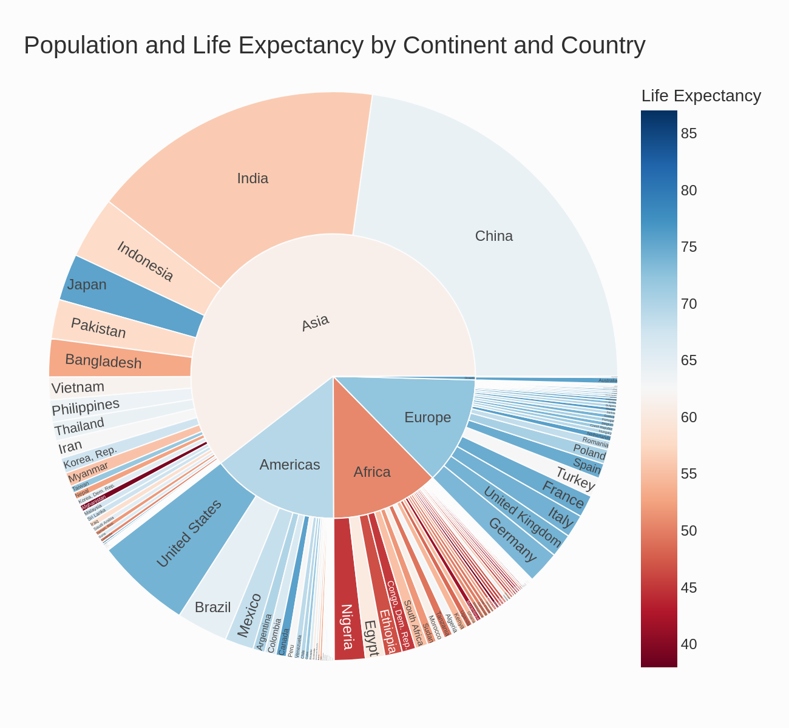
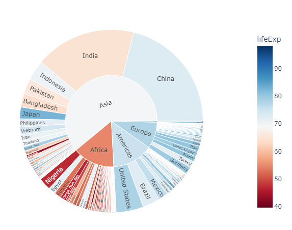
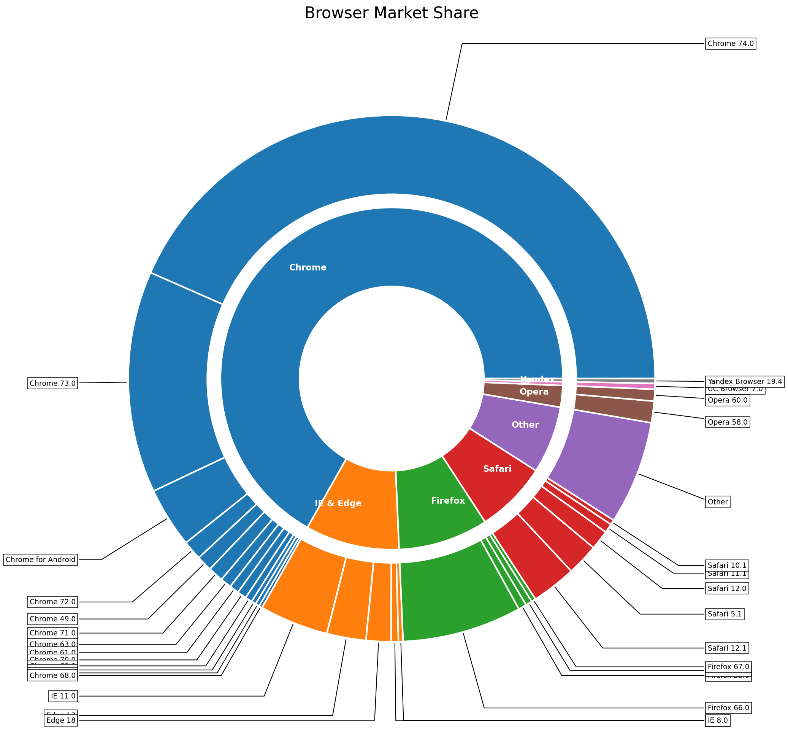
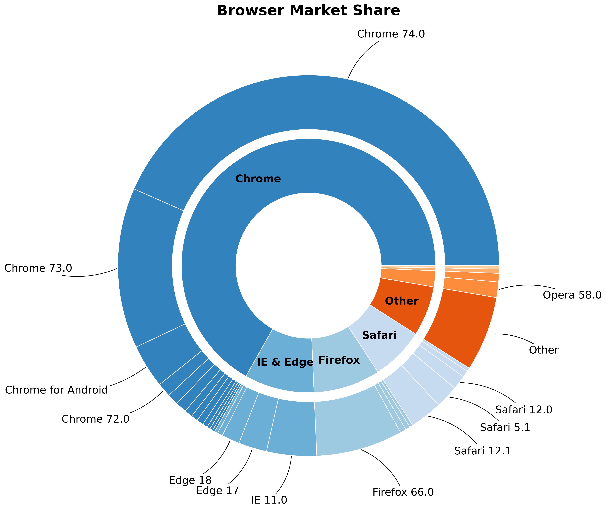

# CoDA: Agentic Systems for Collaborative Data Visualization

<p align="center">
  
</p>

<p align="center">
  <a href="https://coda-agent.github.io/CoDA/static/coda_paper.pdf">
    
  </a>
  <a href="https://coda-agent.github.io/CoDA/">
    
  </a>
  <a href="https://github.com/coda-agent/CoDA">
    
  </a>
  
</p>

> **CoDA: Agentic Systems for Collaborative Data Visualization**
> Zichen Chen, Jiefeng Chen, Sercan O. Arik, Misha Sra, Tomas Pfister, Jinsung Yoon
> *International Conference on Learning Representations (ICLR 2026)*

**CoDA** (Collaborative Data-visualization Agents) is a multi-agent framework that turns natural language queries into publication-quality visualizations. Instead of treating visualization as a monolithic code-generation problem, CoDA distributes the work across 8 specialized LLM agents in four sequential phases — Understanding, Planning, Generation, and Self-Reflection — that iteratively refine the output until explicit quality thresholds are met.

---

## Results

| Benchmark | CoDA | Improvement over Prior SOTA |
|-----------|------|-----------------------------|
| MatplotBench | **79.5%** | **+24.5%** |
| Qwen Code Interpreter | **89.0%** | new state-of-the-art |
| DA-Code | **39.0%** | **+2×** prior best |
| Human Evaluation (Elo) | **1701** | outperforms all baselines |

---

## Architecture

<p align="center">
  
</p>

CoDA employs 8 specialized LLM agents across 4 phases. A **global TODO list** is generated by `QueryAnalyzer` at the start and is propagated through every subsequent agent; `VisualEvaluator` uses image-level analysis to verify completion before the workflow terminates.

| Phase | Agent | Responsibility |
|-------|-------|----------------|
| **1 — Understanding** | `QueryAnalyzer` | Parses intent, expands ambiguous queries, produces a structured TODO checklist |
| | `DataProcessor` | Loads heterogeneous data files, infers schema and statistics |
| **2 — Planning** | `VisualizationMappingAgent` | Assigns data columns to visual roles (axes, color, size) and selects chart type |
| | `DesignExplorer` | Specifies color scheme, layout, typography, and accessibility choices |
| **3 — Generation** | `SearchAgent` | Retrieves real matplotlib gallery examples to bias the code generator |
| | `CodeGenerator` | Produces clean, runnable matplotlib code grounded in the design spec |
| **4 — Self-Reflection** | `DebugAgent` | Executes the code, diagnoses runtime errors, and applies targeted fixes |
| | `VisualEvaluator` | Scores readability, aesthetics, and UX; triggers refinement if below threshold |

---

## Gallery

CoDA consistently produces complete, accurate visualizations scoring **90–95/100**, while baselines frequently produce broken outputs scoring **0–45/100**.

<p align="center">
  
</p>

### Selected outputs

| Task | Benchmark | Score | CoDA Output | Ground Truth |
|------|-----------|-------|-------------|--------------|
| NBA team performance trends — multi-line chart | DA-Code | **100 / 100** |  |  |
| Steam game ratings — scatter plot with trend line | DA-Code | **100 / 100** |  |  |
| Hierarchical data — sunburst chart | MatplotBench | **100 / 100** |  |  |

### Self-reflection recovery

CoDA's self-reflection loop detected layout and labeling errors across 3 iterations, then automatically recovered at iteration 4 — demonstrating the robustness of quality-driven refinement.

| Iter 3 (Failed) | Iter 4 (Recovered) |
|-----------------|-------------------|
|  |  |

---

## Installation

**Requirements:** Python ≥ 3.8 and API credentials for at least one LLM provider.

```bash
git clone https://github.com/coda-agent/CoDA.git
cd CoDA
pip install -r requirements.txt
```

Configure your API keys:

```bash
cp .env.example .env
# Fill in OPENAI_API_KEY, ANTHROPIC_API_KEY, GEMINI_API_KEY, etc.
```

---

## Usage

### Simple API

```python
import coda

result = coda.plot(
    query="Create a sunburst chart showing browser market share by version.",
    data="path/to/data.csv",   # CSV, JSON, Excel, SQLite, or a directory
    output="result.png",
)
print(f"Quality: {result.quality_score:.2f}  —  saved to {result.output_file}")
```

### Programmatic Workflow

```python
from coda import Workflow
from coda.workflow.orchestrator import WorkflowConfiguration

cfg = WorkflowConfiguration(
    quality_threshold=0.9,
    max_iterations=3,
    enable_search_agent=True,
    output_directory="outputs/",
)

wf = Workflow(config=cfg, query_id="q001")
result = wf.execute_workflow(
    query="Plot monthly active users with a 90-day rolling average.",
    data_input="data/mau.csv",
    workflow_context={"original_data_path": "data/mau.csv"},
)

print(f"Success: {result.final_success}  |  Quality: {result.final_quality_score:.2f}")
# Output image: outputs/<model>_query_q001/query_1/final_result.png
```

---

## Benchmarks

### 1 — Download benchmark data

```bash
bash prepare_benchmark.sh
# Downloads MatPlotAgent benchmark into benchmark_data/
```

### 2 — Run generation

```bash
python run_benchmark.py \
    --start 1 --end 100 \
    --model-name        openai/gpt-4o \
    --search-model-name openai/gpt-4o-mini
```

Results are saved to `benchmark_outputs/<model>_query_<id>/`.

### 3 — Run evaluation

```bash
python run_evaluation.py \
    --results-dir   benchmark_outputs \
    --start 1 --end 100 \
    --model-name         openai/gpt-4o \
    --vision-model-name  openai/gpt-4o \
    --processes 10
```

Model tags follow the [LiteLLM](https://docs.litellm.ai/docs/providers) naming convention (`provider/model-name`). Any provider supported by LiteLLM — OpenAI, Anthropic, Google Gemini, Groq, etc. — works out of the box.

---

## Citation

```bibtex
@inproceedings{chen2026coda,
  title     = {{CoDA}: Agentic Systems for Collaborative Data Visualization},
  author    = {Chen, Zichen and Chen, Jiefeng and Arik, Sercan O. and
               Sra, Misha and Pfister, Tomas and Yoon, Jinsung},
  booktitle = {International Conference on Learning Representations},
  year      = {2026},
  url       = {https://coda-agent.github.io/CoDA/}
}
```

---

## License

Apache 2.0 License — see [`LICENSE`](LICENSE) for details.

## Disclaimer
This is not an officially supported Google product. This project is not eligible for the [Google Open Source Software Vulnerability Rewards Program](https://bughunters.google.com/open-source-security).

This project is intended for demonstration purposes only. It is not intended for use in a production environment.
